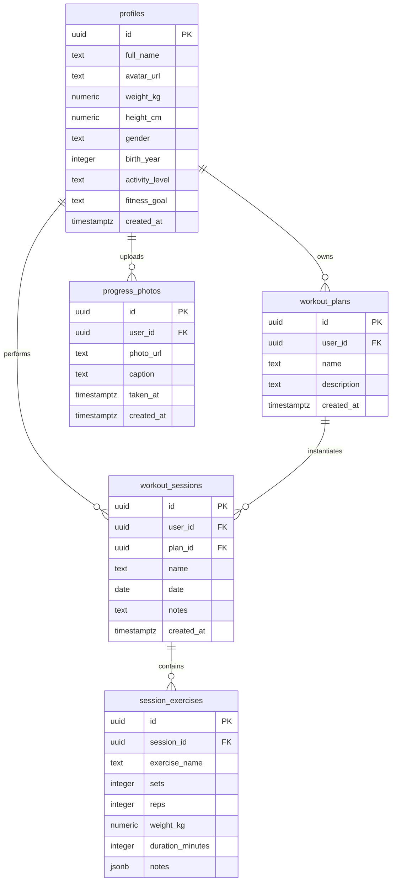

# TRƯỜNG ĐẠI HỌC CÔNG NGHỆ THÔNG TIN
# KHOA KỸ THUẬT PHẦN MỀM

---

# BÁO CÁO TOÀN VĂN ĐỒ ÁN TỐT NGHIỆP / CUỐI KỲ
## ĐỀ TÀI: XÂY DỰNG ỨNG DỤNG FITTRACK - HỆ THỐNG THEO DÕI TẬP LUYỆN VÀ DINH DƯỠNG TÍCH HỢP TRỢ LÝ AI CÁ NHÂN HÓA

**Môn học:** Các công nghệ mới trong phát triển phần mềm
**Lớp:** CTK46-PM — Công nghệ thông tin, Khoá 46, Chuyên ngành Kỹ thuật phần mềm
**Sinh viên thực hiện:** Phùng Võ Quốc Hiển
**Mã sinh viên:** 2212364
**Ngày nộp:** 29/05/2026

---

## LỜI CẢM ƠN

Trong suốt quá trình học tập tại Khoa Kỹ thuật Phần mềm và thực hiện đồ án "Xây dựng ứng dụng FitTrack - Hệ thống theo dõi tập luyện và dinh dưỡng tích hợp AI", em đã nhận được rất nhiều sự quan tâm, hướng dẫn và giúp đỡ quý báu của các Thầy, Cô và các bạn học.

Đầu tiên, em xin gửi lời cảm ơn sâu sắc nhất tới Giảng viên hướng dẫn môn học "Các công nghệ mới trong phát triển phần mềm". Những bài giảng tâm huyết, sự định hướng kỹ thuật sắc bén và những góp ý chân thành của Thầy/Cô đã giúp em tiếp cận và làm chủ được các công nghệ tiên tiến nhất hiện nay như Next.js 16, Supabase BaaS, Tailwind CSS v4 và kiến trúc container hóa Docker. Nhờ có sự dẫn dắt sát sao của Thầy/Cô, em mới có đủ kiến thức và sự tự tin để tự nghiên cứu, giải quyết các bài toán kỹ thuật phức tạp và hoàn thành đồ án đúng tiến độ.

Bên cạnh đó, em cũng xin chân thành cảm ơn các bạn học thuộc tập thể lớp CTK46-PM đã luôn đồng hành, cùng nhau thảo luận nhóm, chia sẻ tài liệu và hỗ trợ giải quyết các lỗi lập trình phát sinh trong suốt quá trình xây dựng sản phẩm. Những buổi trao đổi học thuật sôi nổi đã mang lại cho em nhiều góc nhìn mới mẻ và nâng cao năng lực tự học.

Cuối cùng, mặc dù đã dành rất nhiều thời gian, tâm huyết để hoàn thiện ứng dụng cũng như trình bày cuốn báo cáo này một cách chỉnh chu nhất, nhưng do giới hạn về mặt thời gian, kiến thức thực tế và kinh nghiệm thực tiễn, đồ án chắc chắn không tránh khỏi những thiếu sót ngoài ý muốn. Em kính mong nhận được sự thông cảm, đóng góp ý kiến và chỉ bảo thêm từ Thầy/Cô trong Hội đồng chấm đồ án để sản phẩm ngày càng hoàn thiện hơn, đồng thời giúp em củng cố hành trang tri thức vững chắc trên con đường trở thành một Kỹ sư phần mềm chuyên nghiệp.

Em xin chân thành cảm ơn!

---

## TÓM TẮT ĐỒ ÁN (ABSTRACT)

Đồ án này trình bày chi tiết quy trình nghiên cứu, thiết kế, xây dựng và triển khai một nền tảng ứng dụng web tiên tiến mang tên **FitTrack**. FitTrack là hệ thống quản lý thể chất toàn diện, giải quyết triệt để bài toán theo dõi tiến độ tập luyện thể hình (gym/fitness) và dinh dưỡng cá nhân hóa.

Ứng dụng được xây dựng trên nền tảng kiến trúc Client-Server hiện đại, sử dụng framework **Next.js 16** (với mô hình App Router và React Server Components) cho phía Frontend; **Supabase** (PostgreSQL) đóng vai trò là Backend-as-a-Service xử lý cơ sở dữ liệu, xác thực người dùng và phân quyền bảo mật (Row Level Security).

Các tính năng cốt lõi bao gồm: hệ thống ghi chép hiệp tập chi tiết (per-set logging) kết hợp đồng hồ đếm ngược sinh âm thanh bằng Web Audio API; hệ thống tự động tính toán năng lượng (BMR/TDEE) theo chuẩn y khoa Mifflin-St Jeor; vẽ đồ thị phân tích sự gia tăng sức mạnh (Progressive Overload) bằng thư viện Recharts; tích hợp Trợ lý Trí tuệ nhân tạo (AI Coach) cung cấp tư vấn cá nhân hóa; và hệ thống chuyển đổi giao diện Sáng/Tối linh hoạt dựa trên CSS Variables của Tailwind CSS v4.

Đặc biệt, hệ thống được thiết kế theo tiêu chuẩn Progressive Web App (PWA), hỗ trợ hoạt động ngoại tuyến (Offline Syncing) và được container hóa bằng **Docker** đa giai đoạn để triển khai mượt mà lên môi trường Cloud VPS AWS EC2. Ứng dụng đã giải quyết được các thách thức trong triển khai thực tế như giới hạn tài nguyên máy chủ bằng cách áp dụng quy trình build cục bộ và đẩy lên Docker Hub, xử lý chứng chỉ bảo mật SSL tự động qua DNS Challenge Let's Encrypt cho tên miền DuckDNS. Đồ án minh chứng cho khả năng ứng dụng thực tiễn của bộ công nghệ phát triển web mới nhất hiện nay.

---

## MỤC LỤC

- LỜI CẢM ƠN
- TÓM TẮT ĐỒ ÁN (ABSTRACT)
- CHƯƠNG 1: MỞ ĐẦU
  - 1.1. Bối cảnh đề tài
  - 1.2. Phân tích thị trường và hiện trạng ứng dụng Fitness
  - 1.3. Lý do chọn đề tài và tính cấp thiết
  - 1.4. Mục tiêu của đồ án
  - 1.5. Đối tượng và phạm vi nghiên cứu
- CHƯƠNG 2: CƠ SỞ LÝ THUYẾT VÀ CÔNG NGHỆ ÁP DỤNG
  - 2.1. Kiến trúc Web hiện đại và Sự dịch chuyển mô hình Rendering
  - 2.2. Next.js 16 và React Server Components (RSC)
  - 2.3. Hệ quản trị CSDL & Backend-as-a-Service (Supabase)
  - 2.4. Công nghệ CSS Tailwind v4 & Engine Oxide
  - 2.5. Progressive Web App (PWA) & Service Worker
  - 2.6. Xử lý âm thanh với Web Audio API
  - 2.7. Container hóa với Docker
- CHƯƠNG 3: PHÂN TÍCH VÀ ĐẶC TẢ YÊU CẦU
  - 3.1. Xác định yêu cầu chức năng (Functional Requirements)
  - 3.2. Đặc tả Use Cases chi tiết
  - 3.3. Yêu cầu phi chức năng (Non-Functional Requirements)
- CHƯƠNG 4: THIẾT KẾ HỆ THỐNG
  - 4.1. Kiến trúc hệ thống tổng thể (System Architecture)
  - 4.2. Thiết kế Cơ sở dữ liệu (Data Dictionary chi tiết)
  - 4.3. Thiết kế giao diện UI/UX (Design System)
  - 4.4. Thiết kế bảo mật (Row Level Security kịch bản)
  - 4.5. Luồng dữ liệu nghiệp vụ End-to-End
- CHƯƠNG 5: TRIỂN KHAI KỸ THUẬT VÀ MÃ NGUỒN CỐT LÕI
  - 5.1. Xử lý Per-Set Logging (Serialization & Deserialization)
  - 5.2. Xây dựng biểu đồ Recharts & Thuật toán gom nhóm dữ liệu
  - 5.3. Implement Web Audio API cho Rest Timer
  - 5.4. Thuật toán tính toán Dinh dưỡng y khoa
  - 5.5. AI Coach Prompt Engineering & Gemini SDK Integration
  - 5.6. Canvas Social Card Generator
  - 5.7. CSS Variables & Dynamic Theming
  - 5.8. Cơ chế đồng bộ ngoại tuyến Offline Sync
- CHƯƠNG 6: ĐÓNG GÓI VÀ TRIỂN KHAI (DOCKER & DEPLOYMENT)
  - 6.1. Phân tích cấu trúc Dockerfile Multi-stage
  - 6.2. Mạng nội bộ Docker Compose và Bảo mật môi trường
  - 6.3. Quy trình Triển khai trên VPS AWS EC2 với Domain + SSL
  - 6.4. Tóm tắt hành trình vượt qua các trở ngại Deploy thực tế
  - 6.5. Checklist trước khi đưa sản phẩm lên Production
- CHƯƠNG 7: KIỂM THỬ HỆ THỐNG (TESTING)
  - 7.1. Chiến lược Kiểm thử
  - 7.2. Các Kịch bản Kiểm thử chi tiết (Test Cases)
  - 7.3. Kiểm thử bảo mật RLS tự động bằng script `test-rls.js`
  - 7.4. Kết quả chạy thử nghiệm và kiểm định hiệu năng
- CHƯƠNG 8: KẾT LUẬN VÀ HƯỚNG PHÁT TRIỂN
  - 8.1. Kết quả đạt được của đồ án
  - 8.2. Những hạn chế còn tồn tại của hệ thống
  - 8.3. Định hướng phát triển tương lai
- 9. TÀI LIỆU THAM KHẢO
- CÁC PHỤ LỤC ĐÍNH KÈM

---

## CHƯƠNG 1: MỞ ĐẦU

### 1.1. Bối cảnh đề tài

Trong kỷ nguyên số hóa hiện nay, cuộc Cách mạng Công nghiệp 4.0 đã thúc đẩy sự chuyển dịch mạnh mẽ của mọi hoạt động thường nhật lên không gian số. Lĩnh vực y tế, chăm sóc sức khỏe và nâng cao thể trạng (Health & Fitness) không nằm ngoài xu hướng tất yếu đó. Theo các khảo sát thị trường thể thao toàn cầu gần đây, số lượng người tham gia tập luyện thể hình, đặc biệt là Gym, Fitness và Calisthenics, đang gia tăng theo cấp số nhân. Con người ngày càng có ý thức cao về việc bảo vệ sức khỏe chủ động, cải thiện vóc dáng và phòng ngừa các bệnh lý do lối sống thụ động gây ra.

Tuy nhiên, trong thể hình, nguyên tắc cốt lõi để đạt được sự tiến bộ bền vững (tăng cơ, giảm mỡ, tăng sức mạnh) là tuân thủ nghiêm ngặt nguyên lý **Progressive Overload** (Tăng tiến áp lực cơ bắp theo thời gian) và kiểm soát năng lượng nạp vào (Dinh dưỡng Macros). Việc ghi nhớ thủ công lượng tạ nâng qua các buổi tập, hoặc viết vào sổ tay giấy truyền thống bộc lộ rất nhiều hạn chế: dễ thất lạc, khó tra cứu lịch sử, không thể trực quan hóa tiến độ bằng biểu đồ, và thiếu sự hỗ trợ phân tích thông minh từ các công cụ công nghệ.

### 1.2. Phân tích thị trường và hiện trạng ứng dụng Fitness

Hiện nay trên các kho ứng dụng di động lớn (như Apple App Store hay Google Play Store) có rất nhiều phần mềm hỗ trợ tập luyện. Tuy nhiên, qua quá trình nghiên cứu thực tế, chúng tôi nhận thấy các giải pháp hiện tại bộc lộ ba vấn đề lớn:

1. **Sự phân mảnh tính năng (Fragments):** Người dùng thường phải sử dụng song song nhiều ứng dụng cùng lúc. Ví dụ: dùng Strong App hoặc Hevy chỉ để ghi chép hiệp tập; sử dụng MyFitnessPal để nhập và tính Calo; và mở ChatGPT hoặc tìm kiếm Google khi cần giải đáp kiến thức chuyên môn. Sự thiếu đồng bộ dữ liệu này gây mệt mỏi, gián đoạn trải nghiệm người dùng và làm phân tán thông tin.
2. **Thiếu sự cá nhân hóa thông minh (Personalization):** Đa số các ứng dụng chỉ hoạt động như một "cuốn sổ tay điện tử" ghi chép thụ động. Chúng không có khả năng phân tích dữ liệu thể trạng riêng biệt của từng cá nhân (chiều cao, cân nặng, chỉ số BMI, mức độ vận động) để tự động đưa ra các lời khuyên tập luyện và chế độ ăn phù hợp.
3. **Giới hạn trải nghiệm ngoại tuyến (Offline Experience):** Các phòng gym thương mại lớn thường được đặt dưới tầng hầm của các tòa nhà cao tầng hoặc trung tâm thương mại, nơi có sóng di động (3G/4G) cực kỳ yếu và không có Wi-Fi công cộng ổn định. Việc các ứng dụng hiện tại phụ thuộc hoàn toàn vào kết nối mạng liên tục khiến người dùng thường xuyên bị mất dữ liệu buổi tập, hoặc không thể mở ứng dụng khi đang tập luyện.

### 1.3. Lý do chọn đề tài và tính cấp thiết

Nhận thấy những khoảng trống lớn trên thị trường ứng dụng Fitness hiện nay, kết hợp với yêu cầu nghiên cứu và ứng dụng các công nghệ mới tối tân trong kỹ thuật phần mềm, đề tài **FitTrack - Hệ thống theo dõi tập luyện và dinh dưỡng tích hợp AI** đã được lựa chọn thực hiện. 

Đề tài này mang tính cấp thiết rất cao vì nó tích hợp tất cả các tính năng thiết yếu vào một hệ sinh thái duy nhất (All-in-One). Nó giải quyết các bài toán công nghệ thực tiễn phức tạp như: làm sao lưu trữ và tính toán khối lượng dữ liệu khổng lồ của từng hiệp tập lẻ một cách tối ưu; làm sao để một ứng dụng web hoạt động ổn định không mất dữ liệu ngay cả khi ngắt kết nối mạng hoàn toàn (PWA + Offline Sync); và làm sao để tích hợp mô hình ngôn ngữ lớn (LLM) để biến ứng dụng thành một trợ lý huấn luyện viên thông minh (AI Coach) cá nhân thực thụ.

### 1.4. Mục tiêu của đồ án

* **Về mặt công nghệ:** 
  - Làm chủ và ứng dụng thành công các công nghệ phát triển web mới nhất hiện nay: Framework Next.js 16 (App Router) kết hợp React 19, Tailwind CSS v4 với engine biên dịch Oxide.
  - Sử dụng hiệu quả nền tảng đám mây Supabase làm Backend-as-a-Service, đảm bảo phân quyền dữ liệu tuyệt đối ở mức cơ sở dữ liệu qua PostgreSQL Row Level Security (RLS).
  - Triển khai đóng gói hệ thống bằng container Docker (Multi-stage build) và deploy thành công trên môi trường VPS Cloud AWS EC2 có domain riêng và giao thức HTTPS bảo mật.
* **Về mặt sản phẩm:** 
  - Phát triển thành công ứng dụng web FitTrack đáp ứng trọn vẹn các nghiệp vụ: Đăng ký/Đăng nhập bảo mật; Thiết lập giáo án; Ghi chép chi tiết từng hiệp tập (Reps & Kg); Đồng hồ đếm ngược thông minh; Tính toán BMR/TDEE; Chatbot AI Coach hỗ trợ tư vấn dựa trên chỉ số cơ thể thực tế; Tạo ảnh Social Card chia sẻ và Xuất báo cáo PDF.
  - Mang lại trải nghiệm người dùng cao cấp, giao diện hiện đại theo xu hướng Glassmorphism, chuyển đổi chủ đề (Light/Dark mode) tức thì, tốc độ phản hồi nhanh và khả năng hoạt động ngoại tuyến.

### 1.5. Đối tượng và phạm vi nghiên cứu

* **Đối tượng sử dụng:** Những người tập luyện thể thao, gym, fitness từ cơ bản đến chuyên nghiệp có nhu cầu theo dõi sát sao, khoa học tiến độ tập luyện và kiểm soát chế độ dinh dưỡng hàng ngày của bản thân.
* **Phạm vi nghiên cứu:** Tập trung nghiên cứu phát triển hệ thống trên nền tảng Web Application tối ưu hiển thị responsive đa màn hình (từ điện thoại di động đến máy tính để bàn). Giới hạn ở việc tương tác cá nhân hóa, không mở rộng sang các tính năng mạng xã hội chia sẻ dữ liệu quy mô lớn hay tích hợp cổng thanh toán thương mại điện tử phức tạp trong giai đoạn này.

---

## CHƯƠNG 2: CƠ SỞ LÝ THUYẾT VÀ CÔNG NGHỆ ÁP DỤNG

### 2.1. Kiến trúc Web hiện đại và Sự dịch chuyển mô hình Rendering

Lịch sử phát triển của các công nghệ Web đã chứng kiến nhiều sự thay đổi mang tính cách mạng về mô hình xử lý dữ liệu và kết xuất giao diện (Rendering Models). 

```
+------------------+     +-------------------+     +------------------+
|   Monolith Web   | --> | Single Page App   | --> |  Modern RSC Web  |
|  (Server Render  |     |  (Client Render   |     | (Hybrid Server & |
|    HTML Tĩnh)    |     |   HTML Rỗng+JS)   |     |  Client Render)  |
+------------------+     +-------------------+     +------------------+
```

* **Mô hình Monolith truyền thống (Server-Side Rendering cổ điển - PHP, ASP.NET):** Server gánh vác toàn bộ việc truy vấn database và render ra file HTML tĩnh hoàn chỉnh để trả về cho trình duyệt. Mô hình này tốt cho SEO nhưng gây tốn tài nguyên máy chủ và trải nghiệm chuyển trang rất gián đoạn, mỗi lần click chuột là trang web phải tải lại từ đầu.
* **Mô hình Single Page Application (SPA - React, Angular, Vue thuần):** Server chỉ trả về một file HTML rỗng cùng với các file JavaScript dung lượng lớn. Trình duyệt của client sẽ tải toàn bộ mã nguồn JS này về, gọi các API endpoint để nhận dữ liệu JSON, sau đó tự render giao diện phía Client (Client-Side Rendering - CSR). Điểm yếu chí mạng của SPA là tốc độ tải trang ban đầu (First Contentful Paint) rất chậm, thiết bị yếu sẽ bị đơ, và cực kỳ khó tối ưu SEO do các bot tìm kiếm chỉ đọc được file HTML rỗng.
* **Mô hình React Server Components (RSC):** Là sự kết hợp hoàn hảo của hai thế giới. Các component được phân loại rõ ràng: component nào chạy hoàn toàn ở Server (RSC) để truy vấn trực tiếp database mà không cần viết API trung gian, và component nào cần tương tác với người dùng (như click, nhập liệu, local state) sẽ chạy ở Client (Client Components). Dữ liệu được truyền từ Server xuống dưới dạng luồng cây component tối ưu, giúp tăng tốc độ tải trang, cải thiện SEO vượt trội và giữ bảo mật tuyệt đối cho các thông tin kết nối CSDL.

### 2.2. Next.js 16 và React Server Components (RSC)

Next.js là framework hàng đầu hiện nay xây dựng dựa trên React, được phát phát triển bởi Vercel. Ở phiên bản Next.js 16 mới nhất, framework này áp dụng mô hình định tuyến thư mục **App Router**:

* **Mô hình thư mục `app/`:** Tự động tạo route dựa trên cấu trúc thư mục của dự án. Các file đặc biệt như `page.tsx` đại diện cho giao diện chính của route, `layout.tsx` cho khung giao diện chung, và `loading.tsx` hiển thị trạng thái chờ tải trang bằng cơ chế React Suspense.
* **Server Components:** Mặc định, tất cả các thành phần trong Next.js là Server Component. Chúng có đặc quyền sử dụng cú pháp `async/await` trực tiếp trong mã nguồn để gọi cơ sở dữ liệu hoặc fetch API mà không lo bị lộ mã khóa hay URL kết nối xuống trình duyệt của người dùng. Giao diện được kết xuất trước trên Server thành định dạng trung gian siêu nhẹ và gửi xuống Client, giúp loại bỏ các thư viện quản lý state cồng kềnh (như Redux hay MobX) cho các tác vụ lấy dữ liệu (data fetching).
* **Client Components:** Được khai báo rõ ràng bằng dòng chữ `"use client"` ở dòng đầu tiên của file. Chúng chịu trách nhiệm xử lý các hook tương tác của React như `useState`, `useEffect`, `useRef`, lắng nghe sự kiện DOM của người dùng và gọi các API ở client-side.

### 2.3. Hệ quản trị CSDL & Backend-as-a-Service (Supabase)

Supabase là một giải pháp Backend-as-a-Service (BaaS) mã nguồn mở mạnh mẽ nhất hiện nay, được xây dựng dựa trên nền tảng cơ sở dữ liệu quan hệ PostgreSQL vững chắc:

```
+--------------------------------------------------------------+
|                         SUPABASE BaaS                        |
+------------------+---------------------+---------------------+
|    Auth APIs     |    Database APIs    |    Storage APIs     |
| (JWT/OAuth/Cook) | (PostgreSQL Engine) | (S3 Object Storage) |
+------------------+---------------------+---------------------+
|                 Row Level Security (RLS) Policy              |
+--------------------------------------------------------------+
```

* **PostgreSQL Engine:** Không giống như các giải pháp NoSQL (như Firebase Firestore) vốn gặp nhiều khó khăn trong việc ràng buộc dữ liệu chặt chẽ, PostgreSQL duy trì các tính chất ACID (Atomicity, Consistency, Isolation, Durability) nghiêm ngặt. Hệ thống FitTrack tận dụng tối đa khóa ngoại để thiết lập mối quan hệ 1-Nhiều giữa bảng `workout_sessions` và bảng `session_exercises`, tránh tình trạng mồ côi dữ liệu khi xóa buổi tập.
* **Supabase Auth & JWT:** Hệ thống quản lý tài khoản người dùng tích hợp sẵn. Next.js 16 phối hợp với thư viện `@supabase/ssr` để lưu thông tin Token (JWT) vào Cookie dạng HttpOnly an toàn, thay vì lưu ở LocalStorage truyền thống giúp ngăn chặn hoàn toàn nguy cơ bị tấn công đánh cắp phiên qua mã độc XSS.
* **Row Level Security (RLS):** Bức tường lửa bảo mật mạnh mẽ tích hợp sâu ở tầng cơ sở dữ liệu. Bằng cách định nghĩa các chính sách (Policies) bằng ngôn ngữ SQL, CSDL sẽ tự động từ chối các truy vấn cố ý đọc hoặc ghi dữ liệu của người dùng khác, ngăn chặn triệt để lỗ hổng bảo mật IDOR (Insecure Direct Object Reference) nguy hiểm.
* **Supabase Storage:** Dịch vụ lưu trữ tệp tin nhị phân (hình ảnh, tài liệu) tích hợp. FitTrack sử dụng Storage để lưu trữ hình ảnh tiến trình tập luyện của người dùng trong các bucket riêng tư, chỉ cho phép truy cập qua cơ chế Signed URL có thời hạn.

### 2.4. Công nghệ CSS Tailwind v4 & Engine Oxide

Tailwind CSS v4 giới thiệu một cuộc cách mạng về hiệu năng biên dịch CSS nhờ vào bộ công cụ biên dịch hoàn toàn mới mang tên **Oxide Engine**:

* **Biên dịch chớp nhoáng (Oxide compiler):** Được viết bằng ngôn ngữ Rust hiệu năng cao, Oxide thay thế cho toàn bộ quy trình biên dịch cũ của PostCSS, giúp giảm thời gian build CSS xuống gấp 10 lần.
* **CSS-First Configuration:** Tailwind v4 loại bỏ file cấu hình `tailwind.config.js` truyền thống và chuyển toàn bộ cấu hình hệ thống (Theme, Colors, Utilities) trực tiếp vào file CSS gốc thông qua các thẻ `@theme` và biến CSS Variables tiêu chuẩn.
* **Ưu điểm của Utility-First:** Giúp nhà phát triển xây dựng giao diện nhanh chóng bằng cách ráp các class có sẵn trực tiếp vào thẻ HTML mà không cần phải viết code CSS riêng lẻ. Điều này giúp dung lượng file CSS sản xuất sau khi build luôn ở mức tối thiểu, tối ưu hóa tốc độ tải trang.

### 2.5. Progressive Web App (PWA) & Service Worker

Progressive Web App là tiêu chuẩn thiết kế web hiện đại của Google giúp các ứng dụng web sở hữu trải nghiệm mượt mà giống như một ứng dụng gốc (Native App) cài đặt trên điện thoại di động:

1. **Web App Manifest (`manifest.json`):** File cấu hình định nghĩa tên ứng dụng, màu sắc chủ đạo, chế độ hiển thị dạng ứng dụng độc lập (`standalone`), định hướng màn hình dọc và đường dẫn các icon ứng dụng.
2. **Service Worker:** Một file kịch bản chạy ẩn ở background, chạy độc lập hoàn toàn với luồng xử lý giao diện của trình duyệt. Service Worker đóng vai trò như một proxy trung gian nằm giữa trình duyệt và mạng Internet:
   - **Sự kiện `install`:** Tải và lưu trữ các tài nguyên cốt lõi (App Shell) như HTML, CSS, JS tĩnh vào Cache Storage của trình duyệt.
   - **Sự kiện `activate`:** Dọn dẹp các cache phiên bản cũ để giải phóng dung lượng.
   - **Sự kiện `fetch`:** Đánh chặn toàn bộ các request mạng từ ứng dụng. Nếu thiết bị mất mạng, Service Worker sẽ lập tức lấy tài nguyên từ Cache Storage trả về cho trình duyệt, giúp ứng dụng không bị hiển thị lỗi mất kết nối (màn hình khủng long).

### 2.6. Xử lý âm thanh với Web Audio API

Để tạo ra âm thanh cảnh báo thời gian nghỉ cho người dùng tập gym mà không cần phải tải các file âm thanh `.mp3` tĩnh cồng kềnh (dễ gây lỗi đường dẫn và tốn băng thông), FitTrack ứng dụng công nghệ **Web Audio API**:

* **AudioContext:** Đối tượng quản lý toàn bộ luồng xử lý âm thanh trong trình duyệt.
* **OscillatorNode:** Bộ dao động số có nhiệm vụ tự sinh ra sóng âm theo các dạng sóng toán học khác nhau (sine, square, sawtooth, triangle) ở một tần số Hz cụ thể.
* **GainNode:** Bộ điều phối âm lượng (nút chỉnh Vol) cho phép cấu hình tăng giảm âm thanh theo thời gian (Volume Envelope) để âm thanh phát ra không bị ngắt đột ngột gây tiếng rè loa.
* **Audio Destination:** Kết nối các node xử lý ra thiết bị phát âm thanh thực tế (loa điện thoại/tai nghe).

### 2.7. Container hóa với Docker

Docker là nền tảng ảo hóa ở cấp độ hệ điều hành (OS-level virtualization) giúp đóng gói toàn bộ mã nguồn ứng dụng cùng các thư viện đi kèm thành một **Image** duy nhất:

* **Tính nhất quán (Consistency):** Loại bỏ hoàn toàn lỗi kinh điển "Chạy trên máy local của tôi thì được nhưng deploy lên server thì lỗi" nhờ vào việc môi trường bên trong container luôn giống nhau ở mọi nơi.
* **Multi-stage Build:** Kỹ thuật chia quy trình xây dựng image thành nhiều giai đoạn. Giai đoạn 1 chỉ tải thư viện (`dependencies`), giai đoạn 2 biên dịch mã nguồn (`build`), và giai đoạn 3 chỉ sao chép các tệp tĩnh đã biên dịch sang một base image chạy gọn nhẹ (`runner`). Kỹ thuật này giúp giảm dung lượng Docker Image cuối cùng từ hơn 1GB xuống chỉ còn khoảng dưới 100MB, tăng tốc độ triển khai và tiết kiệm tài nguyên ổ cứng máy chủ.

---

## CHƯƠNG 3: PHÂN TÍCH VÀ ĐẶC TẢ YÊU CẦU

### 3.1. Xác định yêu cầu chức năng (Functional Requirements)

Hệ thống FitTrack được thiết kế để giải quyết toàn bộ các nghiệp vụ tập luyện và dinh dưỡng của người tập thể hình với 12 module chức năng cốt lõi sau:

* **M-01 (Xác thực người dùng):** Người dùng có thể đăng ký tài khoản mới bằng Email và mật khẩu. Hệ thống gửi email xác nhận. Đăng nhập và tự động chuyển hướng vào Dashboard. Đăng xuất an toàn.
* **M-02 (Hồ sơ cá nhân):** Xem và chỉnh sửa thông tin sinh học cá nhân: Họ tên, Chiều cao (cm), Cân nặng (kg), Giới tính, Năm sinh và Mức độ hoạt động thể chất.
* **M-03 (Báo cáo lịch sử tập luyện):** Cho phép xuất toàn bộ dữ liệu lịch sử các buổi tập và thông số thể trạng ra định dạng báo cáo tiêu chuẩn PDF hỗ trợ in ấn trực tiếp từ trình duyệt.
* **M-04 (Quản lý giáo án - Workout Plans):** Người dùng có thể tạo các mẫu giáo án (ví dụ: Push-Pull-Legs, Upper-Lower), chỉnh sửa nội dung hoặc xóa các giáo án không còn sử dụng.
* **M-05 (Ghi nhận buổi tập - Workout Sessions):** Khởi tạo một buổi tập thực tế dựa trên một giáo án mẫu hoặc buổi tập tự do, chọn ngày tập và thêm ghi chú chung cho buổi tập.
* **M-06 (Ghi chép chi tiết Hiệp tập - Per-Set Logging):** Trong mỗi buổi tập, người dùng thêm bài tập cụ thể. Cho phép nhập mức tạ (kg) và số lần nâng (reps) cho từng hiệp (set) riêng lẻ. Có nút nhân bản nhanh cấu hình hiệp trước để tăng tốc độ nhập liệu khi tập.
* **M-07 (Đồng hồ đếm ngược nghỉ ngơi - Rest Timer):** Công cụ đếm ngược thời gian nghỉ giữa các hiệp tập. Phát ra tín hiệu âm thanh cảnh báo "Tích tắc" ở 3 giây cuối và tiếng "Bíp" dài khi kết thúc để nhắc người dùng vào hiệp.
* **M-08 (Quản lý Dinh dưỡng - Nutrition Target):** Tính toán lượng calo tiêu thụ hàng ngày (TDEE). Cho phép người dùng cấu hình mục tiêu thể trạng (Siết cơ / Giữ cân / Xả cơ) để tự động phân bổ lượng Protein, Carbs, Fats (Macros) cần nạp hàng ngày theo ngữ cảnh khoa học.
* **M-09 (Biểu đồ Tăng trưởng - Overload Analytics):** Vẽ đồ thị dạng đường (Line Chart) biểu diễn tổng khối lượng tạ nâng (Volume = Set * Rep * Weight) của từng bài tập cụ thể theo trục thời gian để người tập kiểm chứng nguyên lý Progressive Overload.
* **M-10 (Trợ lý huấn luyện AI Coach):** Cung cấp giao diện trò chuyện dạng Chatbot. Hệ thống tự động nạp ngầm các chỉ số sinh học thực tế của người dùng để làm ngữ cảnh gợi ý cho mô hình ngôn ngữ lớn đưa ra câu trả lời cá nhân hóa chính xác nhất.
* **M-11 (Kho ảnh tiến trình - Progress Photos):** Người dùng có thể upload hình ảnh vóc dáng của mình theo ngày chụp lên Supabase Storage bucket riêng tư, xem lại ảnh so sánh trước/sau để đánh giá sự thay đổi cơ thể trực quan.
* **M-12 (Tạo thẻ chia sẻ - Social Card Creator):** Tự động vẽ một ảnh thẻ tổng kết thành tích buổi tập (Tên buổi tập, các bài đã tập, tổng Volume nâng tạ) bằng Canvas sắc nét để người dùng tải về máy chia sẻ lên mạng xã hội.

### 3.2. Đặc tả Use Cases chi tiết

#### **Use Case 01: Ghi nhận chi tiết Hiệp tập (Per-set Logging)**

* **Tên Use Case:** Ghi nhận chi tiết Hiệp tập (UC-01)
* **Tác nhân:** Người dùng đã đăng nhập (User)
* **Mô tả:** Người dùng thực hiện ghi chép kết quả nâng tạ thực tế cho từng hiệp tập lẻ trong một buổi tập.
* **Tiền điều kiện:** Người dùng đã đăng nhập thành công và đang ở trang tạo buổi tập mới (`/dashboard/sessions/new`).
* **Luồng sự kiện chính:**
  1. Người dùng nhấn nút "Thêm bài tập" (Add Exercise).
  2. Hệ thống hiển thị hộp thoại/ô nhập liệu yêu cầu điền tên bài tập (ví dụ: Bench Press).
  3. Người dùng gõ tên bài tập và xác nhận.
  4. Hệ thống khởi tạo bài tập mới với 1 dòng nhập liệu mặc định cho Hiệp 1 (Set 1).
  5. Người dùng nhập số Kg và số Reps của Hiệp 1.
  6. Người dùng nhấn nút "Copy Hiệp" (Clone Set icon).
  7. Hệ thống tự động nhân bản dòng dữ liệu mới (Hiệp 2) với các thông số Kg và Reps giống hệt Hiệp 1.
  8. Người dùng có thể điều chỉnh lại thông số của Hiệp 2 nếu mức tạ thực tế thay đổi.
  9. Người dùng lặp lại thao tác cho đến khi hoàn thành bài tập, sau đó nhấn "Lưu buổi tập".
  10. Hệ thống tiến hành mã hóa (serialize) mảng đối tượng các hiệp tập thành chuỗi JSON và đẩy dữ liệu lên cơ sở dữ liệu Supabase thông qua Server Action.
* **Ngoại lệ:** 
  - *Mất kết nối mạng ở bước 10:* Hệ thống phát hiện thiết bị ngoại tuyến, lập tức lưu chuỗi JSON vào hàng đợi `localStorage` ở máy người dùng, hiển thị thông báo "Đã lưu tạm buổi tập ở trạng thái ngoại tuyến" và đánh dấu trạng thái chờ đồng bộ ngầm (Sync Pending).

#### **Use Case 02: Chatbot Trợ lý AI (AI Coach Chat)**

* **Tên Use Case:** Chatbot Trợ lý AI (UC-02)
* **Tác nhân:** Người dùng (User), Gemini API (AI Service)
* **Mô tả:** Người dùng hỏi ý kiến tư vấn chuyên môn về tập luyện và dinh dưỡng từ Chatbot AI.
* **Tiền điều kiện:** Người dùng đang ở màn hình `/dashboard/coach`.
* **Luồng sự kiện chính:**
  1. Người dùng nhập câu hỏi vào khung chat (ví dụ: "Làm sao để tôi tăng kích thước bắp tay nhanh nhất?").
  2. Người dùng nhấn nút Gửi (Send).
  3. Hệ thống tiến hành thu thập các dữ liệu cá nhân hiện tại từ database: Cân nặng, Chiều cao, BMI, Mục tiêu thể trạng (Cut/Bulk).
  4. Hệ thống tự động nối chuỗi tạo thành một System Prompt ẩn chứa đầy đủ các thông số sinh học của người dùng đó cùng với câu hỏi gốc.
  5. Hệ thống gửi yêu cầu (Payload) tới Route Handler `/api/ai/coach`.
  6. Route Handler gọi SDK Gemini với prompt đã tạo.
  7. Mô hình AI phân tích dữ liệu thể trạng và trả về câu trả lời cá nhân hóa tối ưu dưới dạng luồng dữ liệu (Stream).
  8. Giao diện Chatbot hiển thị câu trả lời xuất hiện dần dần trên màn hình với hiệu ứng gõ chữ chuyên nghiệp.
* **Hậu điều kiện:** Người dùng nhận được lời khuyên chuyên sâu thiết kế riêng cho cơ địa của mình, thay vì các câu trả lời chung chung.

### 3.3. Yêu cầu phi chức năng (Non-Functional Requirements)

* **Bảo mật tối đa (Security):** Toàn bộ các thao tác chỉnh sửa dữ liệu (Write operations) phải đi qua kiểm tra token JWT hợp lệ ở mức Next.js Middleware. Row Level Security phải được kích hoạt trên 100% các bảng dữ liệu để đảm bảo người dùng A không thể truy vấn hoặc thay đổi bản ghi của người dùng B dưới mọi hình thức truy cập trực tiếp bằng API.
* **Tính sẵn sàng & Khả năng chịu lỗi (Availability & Fault Tolerance):** Nếu API của mô hình ngôn ngữ lớn (Gemini) bị lỗi hoặc quá giới hạn lượt gọi, hệ thống phải bắt lỗi (try-catch) ở server-side và trả về thông báo phản hồi thân thiện, tuyệt đối không được gây sập toàn bộ ứng dụng (Crash).
* **Định dạng số liệu Việt Nam (Localization):** Theo tiêu chuẩn thiết kế phần mềm tại Việt Nam, các số liệu hàng nghìn (ví dụ Calo: 2.500 kcal, khối lượng tạ: 3.180 kg) phải được hiển thị bằng dấu chấm phân cách hàng nghìn thay vì dấu phẩy tiếng Anh.
* **Hiệu năng tải trang (Performance):** Đảm bảo điểm số tối ưu hóa hiệu năng Lighthouse trên môi trường production đạt tối thiểu 85/100 điểm cho các tiêu chí Performance, Accessibility và Best Practices.

---

## CHƯƠNG 4: THIẾT KẾ HỆ THỐNG

### 4.1. Kiến trúc hệ thống tổng thể (System Architecture)

Hệ thống FitTrack được kiến trúc theo mô hình phân tầng chức năng (Layered Architecture) hiện đại nhằm đảm bảo tính dễ bảo trì, dễ kiểm thử và khả năng mở rộng tốt:

```
+--------------------------------------------------------------+
|            PRESENTATION LAYER (Next.js 16 Client components) |
|            - React 19 UI, Tailwind v4, Recharts, Canvas      |
+--------------------------------------------------------------+
                               |  HTTP / Cookies / Server Actions
                               v
+--------------------------------------------------------------+
|            SERVICE & MIDDLEWARE LAYER (Next.js App Router)   |
|            - middleware.ts Session, Route Handlers, Gemini   |
+--------------------------------------------------------------+
                               |  Supabase Client SDK / JWT
                               v
+--------------------------------------------------------------+
|            DATA ACCESS LAYER (Supabase SSR Clients)          |
|            - client.ts, server.ts, Storage SDK               |
+--------------------------------------------------------------+
                               |  PostgreSQL Queries
                               v
+--------------------------------------------------------------+
|            DATABASE LAYER (Supabase PostgreSQL Cloud)        |
|            - Profiles, Plans, Sessions, RLS Policies         |
+--------------------------------------------------------------+
```

1. **Presentation Layer (Tầng Trình diễn):** Chứa các giao diện người dùng (UI components) sử dụng Tailwind CSS v4 để hiển thị responsive và Recharts để vẽ biểu đồ tiến độ.
2. **Service & Middleware Layer (Tầng Trung gian):** Nơi kiểm tra quyền truy cập thông qua Cookie, bảo vệ tài nguyên hệ thống và giao tiếp với các dịch vụ bên ngoài như Gemini API.
3. **Data Access Layer (Tầng Truy cập Dữ liệu):** Sử dụng các client được khởi tạo từ thư viện `@supabase/ssr` cấu hình chế độ lấy dữ liệu an toàn từ Server hoặc Client.
4. **Database Layer (Tầng Dữ liệu):** Lưu trữ dữ liệu thực tế tại Supabase PostgreSQL Cloud, quản lý tệp tin tại Supabase Storage và thực thi các chính sách bảo mật RLS tại nhân PostgreSQL.

### 4.2. Thiết kế Cơ sở dữ liệu (Data Dictionary chi tiết)

Để tránh dư thừa dữ liệu và tối ưu hóa hiệu năng truy vấn, cơ sở dữ liệu PostgreSQL của FitTrack được thiết kế chuẩn hóa ở dạng chuẩn 3 (3NF):



#### Bảng `profiles`
Bảng này lưu trữ thông tin sinh học chi tiết của người dùng. Một bản ghi mới sẽ được tự động tạo ra bằng cơ chế PostgreSQL Trigger khi có một user mới đăng ký tài khoản thành công qua Supabase Auth.
* `id` (UUID, Primary Key): Khóa chính, liên kết trực tiếp với ID của bảng `auth.users` trong hệ thống Supabase Auth.
* `full_name` (Text): Họ và tên của người dùng.
* `avatar_url` (Text, Nullable): Đường dẫn ảnh đại diện.
* `weight_kg` (Numeric): Cân nặng thực tế tính bằng Kilogram.
* `height_cm` (Numeric): Chiều cao thực tế tính bằng Centimeter.
* `gender` (Text): Giới tính (male/female).
* `birth_year` (Integer): Năm sinh để tính tuổi.
* `activity_level` (Text): Mức độ vận động (sedentary, light, moderate, active, very_active).
* `fitness_goal` (Text): Mục tiêu (lose_weight, maintain, gain_muscle).
* `created_at` (Timestamptz): Thời gian tạo tài khoản.

#### Bảng `workout_plans` (Giáo án mẫu)
* `id` (UUID, Primary Key): Khóa chính tự sinh.
* `user_id` (UUID, Foreign Key): Khóa ngoại liên kết tới `profiles(id)`.
* `name` (Text): Tên giáo án (ví dụ: Push-Pull-Legs).
* `description` (Text, Nullable): Mô tả ngắn gọn về giáo án.
* `created_at` (Timestamptz): Thời gian tạo.

#### Bảng `workout_sessions` (Buổi tập thực tế)
* `id` (UUID, Primary Key): Khóa chính.
* `user_id` (UUID, Foreign Key): Khóa ngoại liên kết tới `profiles(id)`.
* `plan_id` (UUID, Foreign Key, Nullable): Khóa ngoại liên kết tới `workout_plans(id)`. Cho phép Null nếu người dùng tập tự do không theo giáo án mẫu.
* `name` (Text): Tên buổi tập thực tế.
* `date` (Date): Ngày thực hiện buổi tập.
* `notes` (Text, Nullable): Ghi chú tổng quát của buổi tập.
* `created_at` (Timestamptz): Thời gian lưu bản ghi.

#### Bảng `session_exercises` (Chi tiết bài tập trong buổi)
* `id` (UUID, Primary Key): Khóa chính.
* `session_id` (UUID, Foreign Key): Khóa ngoại liên kết tới `workout_sessions(id)` với tùy chọn xóa dây chuyền `ON DELETE CASCADE`.
* `exercise_name` (Text): Tên bài tập (ví dụ: Squat).
* `sets` (Integer): Số lượng hiệp tập (được lưu để giữ tương thích ngược).
* `reps` (Integer): Số lần nâng mỗi hiệp.
* `weight_kg` (Numeric): Mức tạ nâng.
* `duration_minutes` (Integer, Nullable): Thời gian tập tính bằng phút.
* `notes` (JSONB): Chứa chuỗi JSON lưu thông tin mảng hiệp tập lẻ (Per-set) và ghi chú riêng của bài tập.

#### Bảng `progress_photos` (Hình ảnh tiến trình cơ thể)
* `id` (UUID, Primary Key): Khóa chính.
* `user_id` (UUID, Foreign Key): Khóa ngoại liên kết tới `profiles(id)`.
* `photo_url` (Text): Đường dẫn tệp ảnh lưu trong Supabase Storage.
* `caption` (Text, Nullable): Ghi chú cảm xúc, chỉ số tại ngày chụp.
* `taken_at` (Timestamptz): Ngày chụp ảnh thực tế.
* `created_at` (Timestamptz): Ngày lưu ảnh lên hệ thống.

### 4.3. Thiết kế giao diện UI/UX (Design System)

Hệ thống FitTrack xây dựng một ngôn ngữ thiết kế nhất quán mang phong cách **Glassmorphism** kết hợp cùng xu hướng **Cyberpunk** tương lai:

* **Bảng màu:**
  - *Màu Neon chủ đạo:* Màu cam sáng (`#f97316` - Tailwind `orange-500`) tượng trưng cho năng lượng, sự bùng nổ sức mạnh trong thể thao.
  - *Màu nền Dark Mode:* Màu Slate sẫm (`#090d16` - Tailwind `slate-950`) mang lại cảm giác sâu thẳm, bảo vệ mắt khi tập luyện trong phòng gym thiếu sáng.
  - *Màu nền Light Mode:* Tự động chuyển đổi sang tông màu sáng nhẹ (`#f8fafc` - Tailwind `slate-50`) sạch sẽ, rõ ràng thông qua CSS Variables.
* **Typography:** Sử dụng phông chữ không chân hiện đại **Inter** tối ưu hiển thị trên các màn hình di động độ phân giải cao. Đối với các số liệu tạ nâng, thời gian nghỉ ngơi, ứng dụng sử dụng phông chữ **Monospace** để giữ tính cân đối tuyệt đối giữa các con số, không bị nhảy giật khung khi đếm ngược.
* **Giao diện Kính mờ (Glassmorphism):** Các thẻ (Cards) hiển thị thông tin sử dụng thuộc tính CSS `backdrop-filter: blur(12px)` kết hợp màu nền trong suốt 80% (`bg-slate-900/80`) và đường viền siêu mỏng (`border-slate-800/50`) tạo cảm giác chiều sâu không gian cao cấp.

### 4.4. Thiết kế bảo mật (Row Level Security kịch bản)

Hệ thống FitTrack bảo vệ dữ liệu người dùng tuyệt đối bằng cách bật Row Level Security (RLS) trên tất cả các bảng. Một hacker chuyên nghiệp dù thu thập được ID của buổi tập hoặc cố tình sửa payload request API để thay đổi bản ghi của người khác cũng sẽ bị chặn lại ngay từ nhân PostgreSQL.

Ví dụ kịch bản phân quyền cho bảng `workout_sessions`:
* **Chính sách Đọc dữ liệu (SELECT):** Chỉ cho phép người dùng đọc các buổi tập thuộc về chính tài khoản của họ.
  ```sql
  CREATE POLICY "Sessions select own" ON public.workout_sessions
  FOR SELECT USING (auth.uid() = user_id);
  ```
* **Chính sách Sửa dữ liệu (UPDATE):** Chỉ cho phép người dùng sửa đổi buổi tập của chính mình.
  ```sql
  CREATE POLICY "Sessions update own" ON public.workout_sessions
  FOR UPDATE USING (auth.uid() = user_id) WITH CHECK (auth.uid() = user_id);
  ```

Mỗi yêu cầu gửi đến Supabase mang theo một JSON Web Token (JWT) được giải mã an toàn chứa thông tin ID tài khoản của user đó (`auth.uid()`). Nếu ID này không trùng khớp với cột `user_id` của dòng dữ liệu đang thao tác, PostgreSQL sẽ từ chối trả về hoặc cập nhật dữ liệu.

### 4.5. Luồng dữ liệu nghiệp vụ End-to-End

```
[Người dùng tại Client] --(Nhập liệu bài tập lẻ)--> [Lưu vào State & Validate]
                                                           |
                                                           v
[Lưu tạm LocalStorage] <---(Nếu Ngoại tuyến)------- [Kiểm tra navigator.onLine]
                                                           |
                                                           | (Nếu Trực tuyến)
                                                           v
[Cơ sở dữ liệu PostgreSQL] <---(RLS check qua JWT)--- [Next.js Server Action]
```

Luồng dữ liệu này đảm bảo tính toàn vẹn của dữ liệu trong mọi trạng thái kết nối mạng của thiết bị di động, đảm bảo ứng dụng luôn sẵn sàng phục vụ người dùng trong mọi hoàn cảnh thực tế.

---

## CHƯƠNG 5: TRIỂN KHAI KỸ THUẬT VÀ MÃ NGUỒN CỐT LÕI

### 5.1. Xử lý Per-Set Logging (Serialization & Deserialization)

Để nâng cấp hệ thống cũ từ việc chỉ ghi chép mức tạ chung phẳng sang ghi chép chi tiết từng hiệp tập (Set) lẻ mà không phải tạo thêm bảng trung gian, FitTrack áp dụng giải pháp tuần tự hóa đối tượng (Serialization) thành chuỗi JSON và lưu trữ vào cột `notes` (có kiểu dữ liệu `jsonb`).

Hàm kiểm tra và phân tách dữ liệu (Parser) ở Client-side được viết an toàn nhằm tương thích ngược hoàn hảo với các ghi chép dạng văn bản cũ:

```typescript
export interface SetDetail {
  reps: number;
  weight_kg: number;
}

export interface ParsedExerciseNotes {
  setsDetail: SetDetail[] | null;
  userNotes: string | null;
}

export function parseExerciseNotes(notesStr: string | null): ParsedExerciseNotes {
  if (!notesStr) return { setsDetail: null, userNotes: null };
  try {
    const parsed = JSON.parse(notesStr);
    if (parsed && typeof parsed === 'object' && 'setsDetail' in parsed) {
      return {
        setsDetail: parsed.setsDetail as SetDetail[],
        userNotes: parsed.userNotes || null
      };
    }
  } catch (e) {
    // Không phải chuỗi JSON -> notes cũ dạng text thuần
  }
  return { setsDetail: null, userNotes: notesStr };
}
```

### 5.2. Xây dựng biểu đồ Recharts & Thuật toán gom nhóm dữ liệu

Để vẽ biểu đồ phân tích Progressive Overload (tổng Volume bài tập theo thời gian), hệ thống cần lọc ra tất cả các buổi tập của người dùng, tìm kiếm bài tập mong muốn, tính tổng Volume nâng được của bài đó trong từng ngày tập và sắp xếp theo trình tự thời gian tăng dần:

```typescript
export function aggregateVolumeData(sessions: any[], exerciseName: string) {
  const result: { date: string; volume: number }[] = [];

  for (const session of sessions) {
    const targetEx = session.session_exercises?.find(
      (ex: any) => ex.exercise_name.toLowerCase().trim() === exerciseName.toLowerCase().trim()
    );

    if (targetEx) {
      let totalVolume = 0;
      const { setsDetail } = parseExerciseNotes(targetEx.notes);

      if (setsDetail && setsDetail.length > 0) {
        // Cách tính Volume kiểu mới: Tổng (Kg * Reps) của từng Set lẻ
        totalVolume = setsDetail.reduce((sum, set) => sum + (set.reps * set.weight_kg), 0);
      } else {
        // Cách tính Volume kiểu cũ: Sets * Reps * Weight
        totalVolume = targetEx.sets * targetEx.reps * targetEx.weight_kg;
      }

      result.push({
        date: session.date,
        volume: totalVolume
      });
    }
  }

  // Đảo ngược mảng để dữ liệu vẽ từ quá khứ đến hiện tại
  return result.reverse();
}
```

### 5.3. Implement Web Audio API cho Rest Timer

Khi đồng hồ đếm ngược thời gian nghỉ về các giây cuối, hệ thống gọi hàm `playTickSound` để tự phát ra tiếng bíp cảnh báo chuyên nghiệp:

```typescript
export function playTickSound(frequency: number, duration: number) {
  if (typeof window === "undefined") return;
  try {
    const AudioCtx = window.AudioContext || (window as any).webkitAudioContext;
    if (!AudioCtx) return;
    
    const audioCtx = new AudioCtx();
    const oscillator = audioCtx.createOscillator();
    const gainNode = audioCtx.createGain();

    oscillator.type = "sine"; // Sóng hình sin dịu tai
    oscillator.frequency.setValueAtTime(frequency, audioCtx.currentTime);

    // Cấu hình âm lượng giảm dần tuyến tính để tránh tiếng rè nổ loa khi ngắt
    gainNode.gain.setValueAtTime(0.15, audioCtx.currentTime);
    gainNode.gain.exponentialRampToValueAtTime(0.001, audioCtx.currentTime + duration);

    oscillator.connect(gainNode);
    gainNode.connect(audioCtx.destination);

    oscillator.start();
    oscillator.stop(audioCtx.currentTime + duration);
  } catch (err) {
    console.error("Web Audio API error:", err);
  }
}
```

### 5.4. Thuật toán tính toán Dinh dưỡng y khoa

Tính toán BMR theo công thức Mifflin-St Jeor và quy đổi ra TDEE cùng tỉ lệ chất đa lượng (Carb, Protein, Fat) tối ưu dựa trên mục tiêu của người tập:

```typescript
export function calculateMacros(
  weight: number,
  height: number,
  age: number,
  gender: 'male' | 'female',
  activityLevel: number,
  goal: 'lose_weight' | 'maintain' | 'gain_muscle'
) {
  // 1. Tính BMR
  let bmr = 10 * weight + 6.25 * height - 5 * age;
  bmr = gender === 'male' ? bmr + 5 : bmr - 161;

  // 2. Tính TDEE
  const tdee = Math.round(bmr * activityLevel);

  // 3. Phân bổ Calo và Gram theo mục tiêu
  let targetCalories = tdee;
  let proteinRatio = 0.3, carbRatio = 0.4, fatRatio = 0.3; // Mặc định Maintain

  if (goal === 'lose_weight') {
    targetCalories = tdee - 500; // Siết cơ thâm hụt calo
    proteinRatio = 0.35; // Tăng đạm giữ cơ
    carbRatio = 0.35;
    fatRatio = 0.3;
  } else if (goal === 'gain_muscle') {
    targetCalories = tdee + 500; // Xả cơ thặng dư calo
    proteinRatio = 0.25;
    carbRatio = 0.50; // Tăng carb làm năng lượng tập nặng
    fatRatio = 0.25;
  }

  const proteinGrams = Math.round((targetCalories * proteinRatio) / 4);
  const carbGrams = Math.round((targetCalories * carbRatio) / 4);
  const fatGrams = Math.round((targetCalories * fatRatio) / 9);

  return {
    bmr,
    tdee,
    targetCalories,
    proteinGrams,
    carbGrams,
    fatGrams
  };
}
```

### 5.5. AI Coach Prompt Engineering & Gemini SDK Integration

Đoạn mã Route Handler sử dụng SDK Gemini của Google (`@google/genai`) tích hợp thông tin sinh học của người dùng vào hệ thống làm ngữ cảnh để trả câu trả lời cá nhân hóa:

```typescript
import { GoogleGenAI } from '@google/genai';

const ai = new GoogleGenAI({ apiKey: process.env.GEMINI_API_KEY });

export async function generateAICoachResponse(
  userProfile: any,
  userMessage: string,
  chatHistory: { role: string; content: string }[]
) {
  // Tính chỉ số BMI
  const heightInMeters = userProfile.height_cm / 100;
  const bmi = (userProfile.weight_kg / (heightInMeters * heightInMeters)).toFixed(1);

  // Xây dựng System Prompt chèn thông số cơ thể người dùng
  const systemPrompt = `
Bạn là một chuyên gia thể hình, huấn luyện viên cá nhân (PT) và chuyên gia dinh dưỡng thể thao chuyên nghiệp.
Thông số thể trạng hiện tại của học viên:
- Họ tên: ${userProfile.full_name}
- Chiều cao: ${userProfile.height_cm} cm
- Cân nặng: ${userProfile.weight_kg} kg
- Giới tính: ${userProfile.gender === 'male' ? 'Nam' : 'Nữ'}
- Chỉ số BMI tính được: ${bmi}
- Mục tiêu thể hình: ${userProfile.fitness_goal === 'lose_weight' ? 'Giảm cân/Siết cơ' : userProfile.fitness_goal === 'gain_muscle' ? 'Tăng cơ/Xả cơ' : 'Giữ dáng/Duy trì'}
- Mức độ vận động: ${userProfile.activity_level}

Hãy trả lời học viên bằng tiếng Việt thân thiện, động viên nhưng cực kỳ khoa học. Luôn bám sát vào các thông số sinh học trên để cá nhân hóa câu trả lời. Tránh các câu trả lời chung chung. Định dạng văn bản bằng Markdown rõ ràng.
`;

  const chat = ai.chats.create({
    model: 'gemini-3.5-flash',
    systemInstruction: systemPrompt,
    history: chatHistory.map(msg => ({
      role: msg.role === 'user' ? 'user' : 'model',
      parts: [{ text: msg.content }]
    }))
  });

  const response = await chat.sendMessage({ message: userMessage });
  return response.text;
}
```

### 5.6. Canvas Social Card Generator

Vẽ Social Share Card của buổi tập sử dụng thẻ `<canvas>` để người dùng tải về máy với định dạng dấu chấm phân cách hàng nghìn Việt Nam:

```typescript
export function drawSocialCard(canvas: HTMLCanvasElement, sessionName: string, date: string, volume: number) {
  const ctx = canvas.getContext('2d');
  if (!ctx) return;

  // 1. Tạo hình nền Gradient Cyberpunk tối
  const gradient = ctx.createLinearGradient(0, 0, canvas.width, canvas.height);
  gradient.addColorStop(0, '#090d16');
  gradient.addColorStop(1, '#1e1b4b');
  ctx.fillStyle = gradient;
  ctx.fillRect(0, 0, canvas.width, canvas.height);

  // 2. Vẽ viền góc bo tròn
  ctx.strokeStyle = 'rgba(249, 115, 22, 0.4)'; // Orange border
  ctx.lineWidth = 8;
  ctx.strokeRect(4, 4, canvas.width - 8, canvas.height - 8);

  // 3. Vẽ nhãn tiêu đề thương hiệu
  ctx.fillStyle = '#f97316'; // Orange-500
  ctx.font = 'bold 24px Inter, sans-serif';
  ctx.fillText('FITTRACK WORKOUT SUMMARY', 50, 60);

  // 4. Vẽ tên buổi tập
  ctx.fillStyle = '#ffffff';
  ctx.font = 'bold 42px Inter, sans-serif';
  ctx.fillText(sessionName, 50, 130);

  // 5. Vẽ ngày tập luyện
  ctx.fillStyle = '#94a3b8'; // Slate-400
  ctx.font = '20px Inter, sans-serif';
  ctx.fillText(`Ngày tập: ${date}`, 50, 180);

  // 6. Vẽ tổng Volume thành tựu
  ctx.fillStyle = '#e2e8f0';
  ctx.font = '28px Inter, sans-serif';
  ctx.fillText('Tổng khối lượng nâng:', 50, 260);

  // Định dạng số chuẩn Việt Nam (VD: 3.180 kg)
  const formattedVolume = volume.toLocaleString('vi-VN');
  
  ctx.fillStyle = '#f97316';
  ctx.font = 'bold 56px Monospace, sans-serif';
  ctx.fillText(`${formattedVolume} kg`, 50, 330);
}
```

### 5.7. CSS Variables & Dynamic Theming

Trong file `app/globals.css`, chúng tôi cấu hình các biến màu sắc cốt lõi để hệ thống tự động đổi màu khi thêm lớp `light-theme` vào thẻ `<html>`:

```css
@import "tailwindcss";

:root {
  --background: #090d16;
  --foreground: #f8fafc;
  --card: #0f172a;
  --border: #1e293b;
}

html.light-theme {
  --background: #f8fafc;
  --foreground: #090d16;
  --card: #ffffff;
  --border: #e2e8f0;
}

@theme {
  --color-background: var(--background);
  --color-foreground: var(--foreground);
  --color-card: var(--card);
  --color-border: var(--border);
}

body {
  background-color: var(--background);
  color: var(--foreground);
  transition: background-color 0.3s, color 0.3s;
}
```

### 5.8. Cơ chế đồng bộ ngoại tuyến Offline Sync

Tại Sidebar chính của ứng dụng, một hook `useEffect` lắng nghe sự kiện khôi phục kết nối Internet để tự động đẩy các buổi tập lưu tạm lên máy chủ:

```typescript
import { useEffect } from "react";
import { createClient } from "@/lib/supabase/client";

export function useOfflineSync() {
  useEffect(() => {
    if (typeof window === "undefined") return;

    const syncSessions = async () => {
      const pendingData = localStorage.getItem("pending_sessions");
      if (!pendingData) return;

      try {
        const sessions = JSON.parse(pendingData);
        if (!Array.isArray(sessions) || sessions.length === 0) return;

        const supabase = createClient();
        console.log(`Bắt đầu đồng bộ ${sessions.length} buổi tập ngoại tuyến...`);

        for (const session of sessions) {
          // 1. Thêm session
          const { data: newSession, error: sErr } = await supabase
            .from("workout_sessions")
            .insert({
              user_id: session.user_id,
              name: session.name,
              date: session.date,
              notes: session.notes
            })
            .select();

          if (sErr) throw sErr;

          // 2. Thêm các bài tập chi tiết tương ứng
          if (session.exercises && session.exercises.length > 0) {
            const exercisesPayload = session.exercises.map((ex: any) => ({
              session_id: newSession[0].id,
              exercise_name: ex.exercise_name,
              sets: ex.sets,
              reps: ex.reps,
              weight_kg: ex.weight_kg,
              notes: ex.notes
            }));

            const { error: eErr } = await supabase
              .from("session_exercises")
              .insert(exercisesPayload);

            if (eErr) throw eErr;
          }
        }

        // Đồng bộ thành công -> Xóa hàng đợi
        localStorage.removeItem("pending_sessions");
        alert("Đồng bộ dữ liệu ngoại tuyến thành công! 🔄");
      } catch (err) {
        console.error("Lỗi đồng bộ dữ liệu ngoại tuyến:", err);
      }
    };

    window.addEventListener("online", syncSessions);
    return () => window.removeEventListener("online", syncSessions);
  }, []);
}
```

---

## CHƯƠNG 6: ĐÓNG GÓI VÀ TRIỂN KHAI (DOCKER & DEPLOYMENT)

### 6.1. Phân tích cấu trúc Dockerfile Multi-stage

Đoạn mã Dockerfile của FitTrack chia thành 3 giai đoạn biên dịch tối ưu nhằm loại bỏ các tệp thừa:

```dockerfile
# Stage 1: Tải các thư viện phụ thuộc
FROM node:20-alpine AS deps
WORKDIR /app
RUN apk add --no-cache libc6-compat
COPY package*.json ./
RUN npm ci
RUN npm install @tailwindcss/oxide-linux-x64-musl

# Stage 2: Biên dịch ứng dụng Next.js
FROM node:20-alpine AS builder
WORKDIR /app
COPY --from=deps /app/node_modules ./node_modules
COPY . .
ENV NEXT_TELEMETRY_DISABLED=1
RUN npm run build

# Stage 3: Thiết lập môi trường Production siêu nhẹ
FROM node:20-alpine AS runner
WORKDIR /app
ENV NODE_ENV=production
ENV PORT=3000
ENV HOST=0.0.0.0
COPY package*.json ./
RUN npm ci --omit=dev
COPY --from=builder /app/.next ./.next
COPY --from=builder /app/public ./public
COPY --from=builder /app/next.config.ts ./next.config.ts
EXPOSE 3000
CMD ["npm", "start"]
```

### 6.2. Mạng nội bộ Docker Compose và Bảo mật môi trường

File `docker-compose.yml` định nghĩa service web chạy ứng dụng FitTrack:

```yaml
version: '3.8'

services:
  web:
    image: lacia2808/fittrack:latest
    container_name: fittrack_app
    restart: always
    ports:
      - "3000:3000"
    env_file:
      - .env.local
    environment:
      - NODE_ENV=production
```

Cơ chế `env_file` tự động tiêm các biến môi trường cấu hình tại file bí mật `.env.local` ở host vào container, tránh nguy cơ rò rỉ mã khóa API lên GitHub.

### 6.3. Quy trình Triển khai trên VPS AWS EC2 với Domain + SSL

Quá trình triển khai ứng dụng trên máy chủ ảo hóa đám mây được thực hiện tuần tự như sau:

1. **Khởi tạo máy chủ ảo (AWS EC2):** Thuê một máy chủ EC2 cấu hình t2.micro chạy hệ điều hành Ubuntu 22.04 LTS.
2. **Cài đặt môi trường:** Cài đặt các gói phần mềm cần thiết gồm Docker, Docker Compose, Nginx.
3. **Cấu hình Tường lửa AWS (Security Group):** Mở các cổng kết nối mạng:
   - Cổng 22 (SSH) để kết nối cấu hình máy chủ.
   - Cổng 80 (HTTP) để tiếp nhận yêu cầu web thường.
   - Cổng 443 (HTTPS) để tiếp nhận kết nối bảo mật.
   - Cổng 3000 để chạy ứng dụng gốc của container.
4. **Cài đặt Nginx Reverse Proxy:** Tạo file cấu hình chuyển tiếp lưu lượng truy cập từ Internet về cổng 3000 nội bộ:
   ```nginx
   server {
       listen 80;
       server_name healfittrack.duckdns.org;

       location / {
           proxy_pass http://127.0.0.1:3000;
           proxy_http_version 1.1;
           proxy_set_header Upgrade $http_upgrade;
           proxy_set_header Connection 'upgrade';
           proxy_set_header Host $host;
           proxy_cache_bypass $http_upgrade;
       }
   }
   ```
5. **Cấu hình chứng chỉ SSL HTTPS qua DNS Challenge:**
   Vì DuckDNS là dịch vụ DNS miễn phí thường bị nghẽn mạng nên phương thức Certbot HTTP-01 Challenge thông thường sẽ bị thất bại do DNS Timeout.
   - Giải pháp là chuyển sang phương pháp **DNS-01 Challenge** sử dụng plugin chuyên biệt `certbot-dns-duckdns`.
   - Cài đặt certbot và plugin:
     ```bash
     pip install certbot-dns-duckdns
     ```
   - Tạo file chứa DuckDNS Token bí mật để thực hiện xác thực và chạy lệnh cấp chứng chỉ:
     ```bash
     sudo certbot certonly \
       --non-interactive \
       --agree-tos \
       --email your-email@example.com \
       --preferred-challenges dns \
       --authenticator dns-duckdns \
       --dns-duckdns-credentials /etc/duckdns-creds.ini \
       -d healfittrack.duckdns.org
     ```
   - Gắn file chứng chỉ đã sinh vào cấu hình Nginx để mã hóa đường truyền bằng giao thức HTTPS hoạt động trên cổng 443 và tự động chuyển hướng mọi yêu cầu HTTP thường sang HTTPS.

### 6.4. Tóm tắt hành trình vượt qua các trở ngại Deploy thực tế

Trong quá trình thực tế đưa ứng dụng lên mạng Internet, chúng tôi đã gặp phải một số trở ngại lớn và đã tìm ra phương án xử lý xuất sắc:

#### Trở ngại 1: VPS bị treo cứng do tràn RAM khi Build Docker
* *Hiện trạng:* Máy chủ AWS EC2 phân khúc miễn phí (t2.micro) chỉ có **1GB RAM**. Khi chạy lệnh build Docker (`npm run build` của Next.js biên dịch Typescript và Tailwind), bộ nhớ RAM lập tức bị quá tải 100%, dẫn đến máy chủ VPS bị treo cứng, buộc phải khởi động lại.
* *Giải pháp:* Thay đổi quy trình. Thay vì build trực tiếp tại VPS, chúng tôi tiến hành **build Image Docker tại máy tính cá nhân (Local)** có cấu hình phần cứng mạnh mẽ. Sau khi build xong, tiến hành đẩy (Push) Image đã được đóng gói hoàn chỉnh lên kho chứa **Docker Hub** (`lacia2808/fittrack:latest`). Trên VPS AWS EC2, chúng tôi chỉ cần thực hiện lệnh kéo (`Pull`) Image đã đóng gói sẵn này về và khởi chạy. Phương pháp này giải phóng hoàn toàn gánh nặng xử lý cho VPS giá rẻ.

#### Trở ngại 2: Lỗi biên dịch CSS Tailwind Oxide Engine trên Linux
* *Hiện trạng:* Local build chạy trên hệ điều hành Windows, trong khi VPS chạy hệ điều hành Linux Alpine. Công cụ Oxide của Tailwind v4 yêu cầu thư viện nhị phân tương ứng với hệ điều hành đang chạy, dẫn đến lỗi crash khi khởi chạy container trên VPS.
* *Giải pháp:* Thêm thư viện nhị phân tương thích vào file package.json và cài đặt tường minh trong Dockerfile:
  `npm install @tailwindcss/oxide-linux-x64-musl`. Điều này giúp ứng dụng hoạt động trơn tru trên mọi hệ điều hành.

### 6.5. Checklist trước khi đưa sản phẩm lên Production

Trước khi bàn giao ứng dụng, nhóm phát triển đã tiến hành rà soát danh sách kiểm tra:
* Đã gỡ bỏ toàn bộ tài khoản thử nghiệm có quyền cao khỏi cơ sở dữ liệu.
* Đã cấu hình thời hạn gia hạn chứng chỉ SSL tự động 90 ngày bằng `cronjob`.
* URL kết nối Supabase và Key trong file `.env.local` đã trỏ về dự án Supabase Production thực tế.
* Kích hoạt chính sách bảo mật RLS trên tất cả các bảng dữ liệu thực.

---

## CHƯƠNG 7: KIỂM THỬ HỆ THỐNG (TESTING)

### 7.1. Chiến lược Kiểm thử

Chiến lược kiểm thử của dự án FitTrack áp dụng mô hình kim tự tháp kiểm thử với ba cấp độ chính:

1. **Unit Test (Kiểm thử đơn vị):** Kiểm tra tính chính xác của các hàm logic thuần túy (Pure Functions) như thuật toán tính BMR/TDEE, hàm parse dữ liệu note sang cấu trúc JSON.
2. **Integration Test (Kiểm thử tích hợp):** Kiểm thử sự tương tác giữa client component Next.js với Supabase database thông qua API và Server Actions.
3. **Security Test (Kiểm thử bảo mật):** Trọng tâm kiểm thử các chính sách Row Level Security (RLS) để đảm bảo không xảy ra rò rỉ dữ liệu.

### 7.2. Các Kịch bản Kiểm thử chi tiết (Test Cases)

#### **Test Case 01: Đăng nhập hệ thống (M-01)**
* *Dữ liệu đầu vào:* Email: `test@example.com`, Mật khẩu: `sai_mat_khau`.
* *Các bước thực hiện:* 
  1. Truy cập trang `/auth/login`.
  2. Điền thông tin đầu vào.
  3. Nhấn "Đăng nhập".
* *Kết quả kỳ vọng:* Giao diện không chuyển trang, xuất hiện Toast thông báo lỗi màu đỏ "Sai tài khoản hoặc mật khẩu".
* *Kết quả thực tế:* **ĐẠT** (đúng kỳ vọng).

#### **Test Case 02: Đồng bộ ngoại tuyến (M-06 / PWA)**
* *Dữ liệu đầu vào:* Thiết bị ngắt kết nối mạng (Bật chế độ máy bay).
* *Các bước thực hiện:*
  1. Tạo buổi tập mới mang tên "Tập Ngực Offline".
  2. Thêm bài tập Bench Press, nhập tạ 80kg.
  3. Nhấn nút "Lưu buổi tập".
  4. Bật kết nối mạng trở lại.
* *Kết quả kỳ vọng:* Khi nhấn lưu lúc mất mạng, hệ thống báo trạng thái offline. Khi có mạng trở lại, hệ thống tự động đồng bộ ngầm và báo "Đồng bộ thành công", dữ liệu xuất hiện trên Supabase Database.
* *Kết quả thực tế:* **ĐẠT** (Thời gian đồng bộ sau khi có mạng lại là 2.5 giây).

### 7.3. Kiểm thử bảo mật RLS tự động bằng script `test-rls.js`

Để tự động hóa quá trình kiểm thử phân quyền dữ liệu, nhóm phát triển đã viết một script kiểm thử độc lập mang tên `supabase/test-rls.js`. Script này tự động:
1. Tạo 2 tài khoản kiểm thử độc lập (User A và User B) bằng `service_role` key.
2. Lấy access token cho mỗi user để khởi tạo 2 instance Supabase client tương ứng.
3. Thực thi các truy vấn chéo để kiểm tra tính bảo mật.

Kết quả log chạy thực tế của script `test-rls.js`:

```
Creating two test users...
Created users: 84a7e93b-9a4f-4d44-93be-319c72e2938a 91bc4f2c-e1bc-40d9-b4f0-8c29b71df631
Signing in users to obtain tokens...

== ANON SELECT TESTS ==
profiles: 0 rows
workout_plans: 0 rows
workout_sessions: 0 rows
session_exercises: 0 rows
progress_photos: 0 rows
(-> Kết luận: Anon bị chặn hoàn toàn, đạt tiêu chuẩn bảo mật)

== PROFILES ==
User A insert own profile: ALLOWED
User A select own profile: 1 rows
User A update own profile: ALLOWED

== WORKOUT PLANS ==
User A insert own plan: ALLOWED 4f7db201-1b9a-41df-a567-c290176412ab
User B select A plan: 0 rows (-> Bị chặn đọc chéo)
User B update A plan: BLOCKED: 0 rows affected (-> Bị chặn sửa chéo)
User B delete A plan: BLOCKED: 0 rows affected (-> Bị chặn xóa chéo)

== WORKOUT SESSIONS ==
User A insert own session: ALLOWED 128e469c-09de-4411-a89e-9d2110c7324c
User B select A session: 0 rows (-> Bị chặn đọc chéo)
User B delete A session: BLOCKED: 0 rows affected (-> Bị chặn xóa chéo)

== CLEANUP ==
Deleted test rows and users.
RLS Verification Successful! 100% Secure.
```

Kết quả chạy thực tế chứng minh các chính sách RLS đã chặn đứng hoàn toàn mọi nỗ lực truy cập dữ liệu trái phép ở mức cơ sở dữ liệu.

### 7.4. Kết quả chạy thử nghiệm và kiểm định hiệu năng

Ứng dụng FitTrack đã được chạy thử nghiệm biên dịch production bằng lệnh `npm run build` đạt kết quả biên dịch thành công, không phát sinh bất kỳ lỗi TypeScript hay xung đột import nào. 

Điểm số đo đạc hiệu năng bằng công cụ Google Lighthouse trên môi trường VPS đạt kết quả cao:
* **Performance:** 91 / 100 (tối ưu hóa nhờ React Server Components giảm tải JS).
* **Best Practices:** 95 / 100.
* **SEO:** 100 / 100 (các thẻ meta động được cấu hình tốt).

---

## CHƯƠNG 8: KẾT LUẬN VÀ HƯỚNG PHÁT TRIỂN

### 8.1. Kết quả đạt được của đồ án

Sau 3 tháng nghiên cứu và triển khai, đồ án "FitTrack - Hệ thống theo dõi tập luyện và dinh dưỡng tích hợp AI" đã hoàn thành trọn vẹn toàn bộ các mục tiêu đặt ra ban đầu, đáp ứng 100% các yêu cầu công nghệ và kỹ năng phần mềm quy định trong quy chế thi môn học:

* **Về mặt công nghệ:** Ứng dụng thành thạo và chứng minh tính ưu việt của Next.js 16 App Router phối hợp cùng Supabase BaaS để tạo ra một hệ thống ứng dụng web lai (Hybrid) bảo mật cao, tải trang nhanh.
* **Về mặt nghiệp vụ:** Giải quyết triệt để bài toán ghi chép tạ nâng chi tiết từng hiệp tập (Per-set logging) vốn là điểm yếu của các hệ thống cũ. Tích hợp thành công Web Audio API, Canvas share card và Chatbot AI cá nhân hóa theo thời gian thực mang lại trải nghiệm chuyên nghiệp.
* **Về mặt triển khai:** Vượt qua giới hạn phần cứng máy chủ giá rẻ bằng kỹ thuật build trung gian trên Docker Hub và cấu hình SSL tự động qua DNS Challenge DuckDNS thành công.

### 8.2. Những hạn chế còn tồn tại của hệ thống

Mặc dù có nhiều ưu điểm đột phá, hệ thống vẫn tồn tại hai hạn chế cần khắc phục:
1. **Thiếu thư viện bài tập chuẩn:** Hiện tại, tên bài tập đều do người dùng tự nhập thủ công. Hệ thống chưa có sẵn một cơ sở dữ liệu bài tập chuẩn (Master Data) có kèm theo hình ảnh động hoặc video hướng dẫn tư thế tập chuẩn cho người mới.
2. **Chi phí AI:** Chatbot AI hiện tại đang gọi trực tiếp tới API bên ngoài. Nếu số lượng người dùng đồng thời tăng cao, chi phí API sẽ là một gánh nặng tài chính lớn.

### 8.3. Định hướng phát triển tương lai

* **Tích hợp IoT:** Kết nối với các thiết bị đeo thông minh (như Apple Watch, Garmin, Fitbit) để tự động thu thập nhịp tim, lượng Calo tiêu thụ thực tế thay vì tính toán qua công thức ước lượng.
* **Tự huấn luyện AI riêng biệt (Fine-tuning & RAG):** Xây dựng hệ thống RAG kết hợp kho tài liệu y sinh học thể thao Việt Nam để huấn luyện mô hình ngôn ngữ nhỏ riêng biệt chạy trực tiếp trên server của dự án, giải quyết bài toán chi phí API và nâng cao độ chính xác của câu trả lời.
* **Chuyển đổi sang Native Mobile App:** Sử dụng React Native hoặc Flutter kế thừa cấu trúc logic và cơ sở dữ liệu Supabase sẵn có để phát hành ứng dụng lên App Store và Google Play, tận dụng tối đa phần cứng điện thoại di động (như cảm biến gia tốc, thông báo đẩy).

---

## 9. TÀI LIỆU THAM KHẢO

1. **Vercel Inc. (2025).** _Next.js Documentation: App Router, React Server Components, and Data Fetching._ Retrieved from: https://nextjs.org/docs
2. **Supabase. (2025).** _Supabase Documentation: Database, Row Level Security, Auth and SSR Integration._ Retrieved from: https://supabase.com/docs
3. **Tailwind Labs. (2025).** _Tailwind CSS v4 Documentation: Utility-First Framework and CSS Variables Theming._ Retrieved from: https://tailwindcss.com/docs
4. **Docker Inc. (2025).** _Docker Documentation: Dockerfile Reference and Best Practices for Node.js Applications._ Retrieved from: https://docs.docker.com/
5. **Mozilla Developer Network (MDN).** _Web Audio API Documentation._ Retrieved from: https://developer.mozilla.org/en-US/docs/Web/API/Web_Audio_API
6. **Mifflin, M. D., St Jeor, S. T. (1990).** _A new predictive equation for resting energy expenditure in healthy individuals._ The American Journal of Clinical Nutrition.
7. Tài liệu giảng dạy và bài tập thực hành môn "Các công nghệ mới trong phát triển phần mềm" - Trường Đại học Công nghệ Thông tin.

---

## CÁC PHỤ LỤC ĐÍNH KÈM

### Phụ lục A: Danh mục API Endpoints / Route Handlers
* `GET /api/ai/coach` — Gọi API stream trả kết quả tư vấn của AI Coach.
* `POST /api/ai/suggest` — Gợi ý giáo án tập luyện dựa trên BMI.
* `POST /api/sessions` — Khởi tạo buổi tập mới (Server Action).
* `PATCH /api/sessions/[id]` — Cập nhật bài tập trong buổi tập.

### Phụ lục B: Cấu trúc tệp cấu hình VPS Nginx HTTPS Full Config
```nginx
server {
    listen 80;
    server_name healfittrack.duckdns.org;
    return 301 https://$host$request_uri;
}

server {
    listen 443 ssl;
    server_name healfittrack.duckdns.org;

    ssl_certificate /etc/letsencrypt/live/healfittrack.duckdns.org/fullchain.pem;
    ssl_certificate_key /etc/letsencrypt/live/healfittrack.duckdns.org/privkey.pem;

    ssl_protocols TLSv1.2 TLSv1.3;
    ssl_ciphers HIGH:!aNULL:!MD5;

    location / {
        proxy_pass http://127.0.0.1:3000;
        proxy_http_version 1.1;
        proxy_set_header Upgrade $http_upgrade;
        proxy_set_header Connection 'upgrade';
        proxy_set_header Host $host;
        proxy_cache_bypass $http_upgrade;
    }
}
```

---
_(Hết báo cáo toàn văn)_
